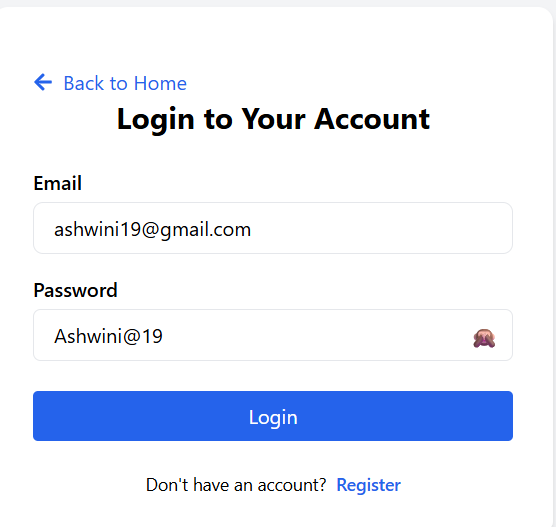
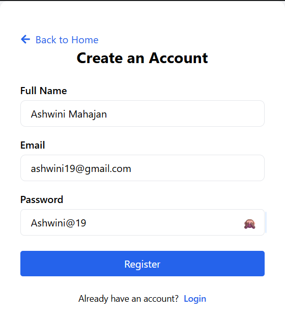

# 🍽️ Digital Menu Card – Smart Restaurant Solution

A modern and responsive restaurant menu management application built using React.js, Tailwind CSS, Node.js, Express.js, and MongoDB.

## 🚀 Project Overview

Digital Menu Card enables customers to browse restaurant menus digitally, search food items, view discounts, manage carts, and enjoy a seamless ordering experience.

## ✨ Features

### 👥 User Features

* User Registration & Login
* Browse Menu by Categories
* Search Food Items
* Grid & List View Options
* Shopping Cart Management
* Responsive Design

### 🔧 Admin Features

* Menu Management
* Category Management
* Product Updates
* Dashboard Access

## 🛠️ Technologies Used

### Frontend

* React.js
* JavaScript (ES6+)
* Tailwind CSS
* React Router
* Axios

### Backend

* Node.js
* Express.js
* MongoDB
* JWT Authentication

## 📸 Screenshots

### 🔐 Login Page

Secure authentication interface allowing users and administrators to access the application.

### 📝 Registration Page

User-friendly registration page for creating a new account.

## 👨‍💻 Roles & Responsibilities

* Designed the complete application workflow and navigation structure.
* Planned user journeys across Home, Menu, Cart, Authentication, and Admin pages.
* Developed responsive user interfaces using React.js and Tailwind CSS.
* Created reusable frontend components.
* Integrated REST APIs for menu, cart, and user management.
* Optimized layouts for desktop, tablet, and mobile devices.

## 📌 Project Status

✅ Completed Portfolio Project

### Developed By

**Ashwini Mahajan**
